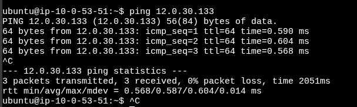

#lets connect two vpc and lets see if we access them by using ec2 instancing by pinging the private address

#this is free of cost if both are in the same az but priced on the data transfers based on transnfer gb

#create a peering id betweeen 2 vpc's, you can add 500 peers using --peer-vpc-id
```sh
aws ec2 create-vpc-peering-connection --vpc-id vpc-083fb878de92a459e --peer-vpc-id vpc-07daff9e00997c845
```

#accept the peering connection
```sh
aws ec2 accept-vpc-peering-connection --vpc-peering-connection-id pcx-0062e14789fe9fe0f
```

#now edit route tables of both vpc to add them to private newtork

#for vpc1
```sh
aws ec2 create-route --route-table-id rtb-0c45319e91f20e60d --destination-cidr-block "12.0.0.0/16" --vpc-peering-connection-id pcx-0062e14789fe9fe0f
```

#for vpc2
```sh
aws ec2 create-route --route-table-id rtb-0a18f24cba1704dda --destination-cidr-block "10.0.0.0/16" --vpc-peering-connection-id pcx-0062e14789fe9fe0f
```

#now you can ping each vpc



#delete the perring then only you can delete those vpcs
```sh
aws ec2 delete-vpc-peering-connection --vpc-peering-connection-id pcx-0062e14789fe9fe0f
```
